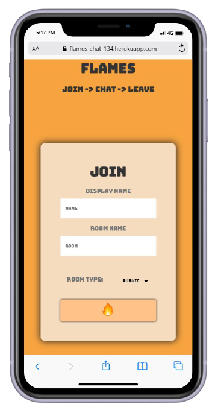
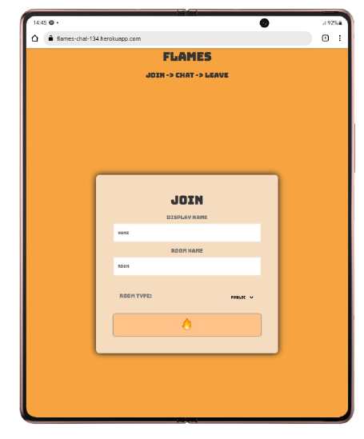
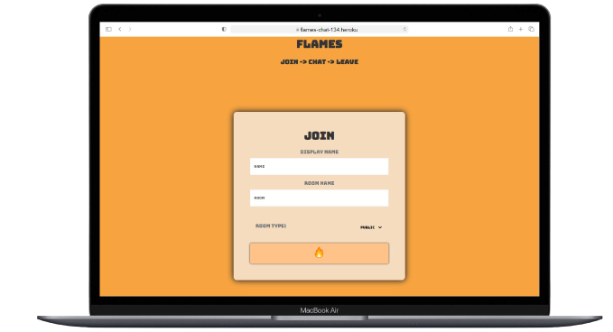

<h1>Flames </h1>

Flames is a chat application , for instant chatting, come chat and go, explore the public rooms and make new friends all at the convenience of being anonymous.

This application is built using socket programming
## Some features
* create rooms public/private
* join public rooms
* No authentication, you can choose to stay anonymous
* Dosent store your chats
* Interact with people
* Share your location ( out of context , but yaaa. 😅)

## some images of this application

